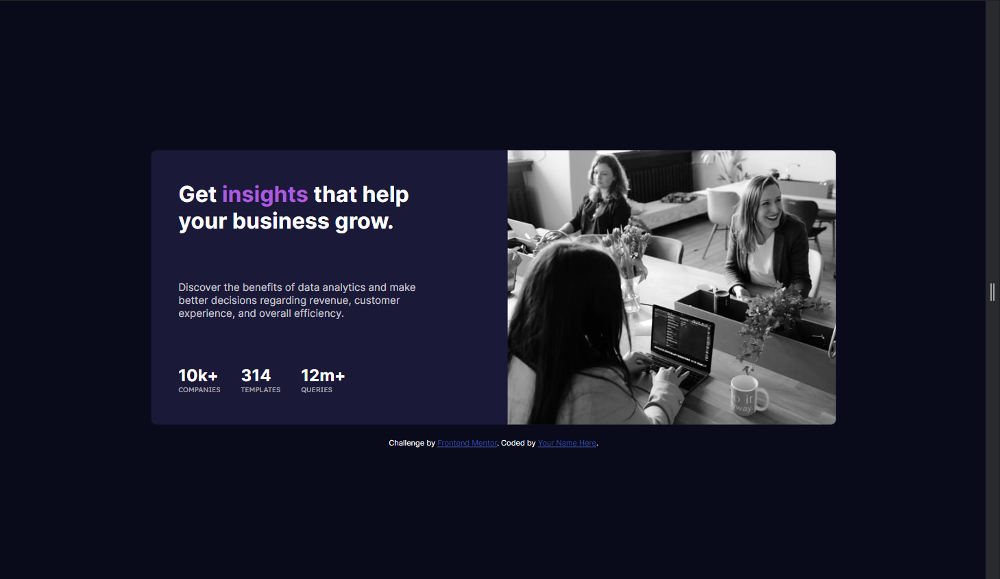

# Frontend Mentor - Stats preview card component solution

This is a solution to the [Stats preview card component challenge on Frontend Mentor](https://www.frontendmentor.io/challenges/stats-preview-card-component-8JqbgoU62). Frontend Mentor challenges help you improve your coding skills by building realistic projects.

## Table of contents

- [Overview](#overview)
  - [Screenshot](#screenshot)
  - [Links](#links)
- [Author](#author)
- [Acknowledgments](#acknowledgments)

## Overview

### The challenge

Users should be able to:

- View the optimal layout depending on their device's screen size

### Screenshot

#### Desktop view

#### mobile view

### Links

- Solution URL: [CODE](https://github.com/MelakuAlehegn/stats-preview-card-component)
- Live Site URL: [Live Site](https://your-live-site-url.com)

### Built with

- Semantic HTML5 markup
- CSS custom properties
- Flexbox
- CSS Grid
- Mobile-first workflow

## Author

- Website - [Melaku Alehegn](http://melakualehegn.tech/)
- Frontend Mentor - [@melakualehegn](https://www.frontendmentor.io/profile/melakualehegn)
- Twitter - [@MelakuA5](https://www.twitter.com/MelakuA5)
